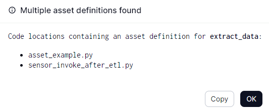

# 使用專案內的python建立job 
- etl1.py : python檔案
- etl_job.py : dagster call etl1.py 的設定檔案
執行: 
```
venv\scripts\activate  
dagster dev -f etl_job.py 
```

# 使用cmd call 專案內的python建立Job


# Tutorial Template Project

This is a [Dagster](https://dagster.io/) project made to be used alongside the official [Dagster tutorial](https://docs.dagster.io/tutorial).

# Windows設立環境變數
setx DAGSTER_HOME "C:\Users\data-taipei\Documents\dagster_tutorial" /M
Write-Host $env:DAGSTER_HOME # Power-shell

echo %DAGSTER_HOME%

venv\scripts\activate
dagster dev

Error: No arguments given and no [tool.dagster] block in pyproject.toml found.
```
[tool.dagster]
storage = "sqlite"
```


## Multiple asset definitions found
dagster裡面的asset有撞名問題，需要修正

